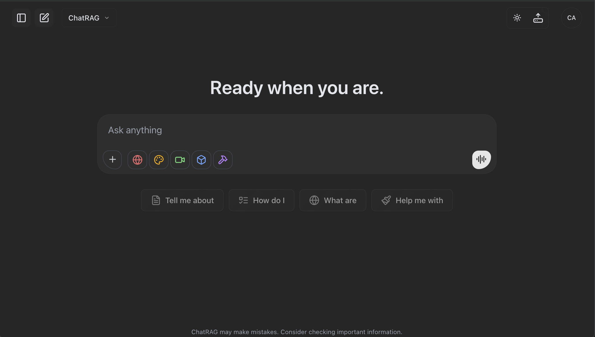

#  ChatRAG - Production-Ready AI Chatbot Platform

<div align="center">
  <h3>Build Unlimited RAG-Powered AI Chatbots in Minutes</h3>
  
  [](https://nextjs.org)
  [](https://react.dev)
  [](https://typescriptlang.org)
  [](https://supabase.com)
  [](https://openrouter.ai)
  [](LICENSE)
  
  <p align="center">
    <strong>Visual Config UI</strong> • 
    <strong>15-28x Faster Search</strong> • 
    <strong>100+ AI Models</strong> • 
    <strong>WhatsApp Ready</strong>
  </p>

  [📚 Docs](#-documentation) • [🚀 Deploy](#-quick-start) • [💬 Discord](https://discord.gg/QYESpZvU)
</div>

---

<div align="center">
  
  <p><em>ChatRAG's beautiful, modern chat interface with dark mode support</em></p>
</div>

---

## 🎉 What's New

- **⬆️ Upgraded Frameworks** – Next.js 16 + React 19 with React Compiler enabled
- **🧠 Reasoning/Thinking Models** - OpenAI o1/o3, Claude 3.7+, DeepSeek R1, Gemini Thinking
- **🌍 AI Translation System** - Automatically translate system prompts to any language
- **📱 Dual WhatsApp Providers** - Choose between Koyeb or Fly.io deployment
- **⚡ HNSW Vector Indexes** - 15-28x faster search performance than traditional RAG
- **🎨 Visual Configuration UI** - Configure everything without touching code

## Why ChatRAG?

<table>
<tr>
<td width="33%" align="center">

**🚀 Ship in Minutes**

Visual config UI lets you launch a production-ready chatbot in under 10 minutes

</td>
<td width="33%" align="center">

**💪 Enterprise Ready**

Multi-tenant architecture with RLS, real-time updates, and battle-tested security

</td>
<td width="33%" align="center">

**♾️ Unlimited Deployment**

Build unlimited chatbots for yourself or clients with full white-label support

</td>
</tr>
</table>

## ✨ Core Features

### 🤖 AI Capabilities

<table>
<tr>
<td width="50%">

**Language Models**
- 100+ models via OpenRouter
- OpenAI GPT-4, GPT-3.5
- Anthropic Claude 3, 3.5, 3.7+
- Google Gemini Pro, Thinking
- DeepSeek R1 reasoning
- o1, o1-mini, o3 models

</td>
<td width="50%">

**Advanced Features**
- Reasoning models with effort control
- Multi-modal generation (text, image, video, 3D)
- Real-time streaming responses
- Tool calling & function execution
- MCP (Model Context Protocol) support
- Voice input/output

</td>
</tr>
</table>

### 📚 RAG System

**HNSW-Optimized Vector Search** - Lightning-fast semantic search

| Feature | Description |
|---------|-------------|
| **Vector Search** | HNSW indexes with 15-28x speed improvement |
| **Query Time** | <50ms for semantic search |
| **Document Support** | PDF, DOCX, TXT, HTML, RTF, EPUB |
| **Smart Processing** | Auto-chunking with configurable overlap |
| **Embeddings** | 1536-dimensional vectors (OpenAI) |
| **Pure Semantic** | Simplified for better accuracy |

### 💬 Communication Channels

- **Web Chat** - Beautiful responsive UI with themes
- **WhatsApp** - Dual-provider support (Koyeb/Fly.io)
- **Embed Widget** - Add to any website
- **API Access** - Full REST API

### 💰 Monetization & Auth

- **Stripe** - Subscriptions & one-time payments
- **Polar** - Alternative payment provider
- **Supabase Auth** - GitHub, Google, email/password
- **Admin Dashboard** - User & subscription management

## 🚀 Quick Start

### Prerequisites

```bash
✅ Node.js 18+ and npm
✅ Supabase account (free tier works)
✅ OpenAI API key (for embeddings)
✅ At least one AI provider API key
```

### Step 1: Clone & Install

```bash
# Clone the repository
git clone https://github.com/yourusername/chatrag.git
cd chatrag

# Install dependencies
npm install
```

### Step 2: Database Setup

1. Create a [Supabase](https://supabase.com) project (free)
2. Open SQL Editor in your Supabase dashboard
3. Copy the entire contents of `supabase/complete_setup.sql`
4. Paste and execute in SQL Editor

This creates:
- 14 production tables with RLS
- HNSW vector indexes (15-28x faster)
- Storage buckets for media
- All required extensions

### Step 3: Configure & Launch

```bash
# Step 1: Install ChatRAG dependencies
npm install

# Step 2: Launch the Visual Configuration Dashboard (IMPORTANT!)
npm run config       # Opens at http://localhost:3333
                    # Configure everything visually - API keys, branding, prompts
                    # No code editing required!

# Step 3: Start your RAG-powered AI chatbot
npm run dev          # Opens at http://localhost:3000
                    # Your chatbot is now ready to use!
```

💡 **Pro Tip**: Keep both `npm run config` and `npm run dev` running in separate terminals to configure while testing!

## 🎯 Key Features Explained

### 🧠 Reasoning/Thinking Models

Support for the latest reasoning-capable AI models:

| Model | Method | Configuration |
|-------|---------|--------------|
| **OpenAI o1/o3** | Effort levels | low/medium/high |
| **Claude 3.7+** | Token-based | Up to 32k reasoning tokens |
| **DeepSeek R1** | Dual method | Effort + tokens |
| **Gemini Thinking** | Token-based | Configurable limits |

Configure globally or per-message:
```env
NEXT_PUBLIC_REASONING_ENABLED=true
NEXT_PUBLIC_DEFAULT_REASONING_EFFORT=medium
NEXT_PUBLIC_MAX_REASONING_TOKENS=8000
```

### 📚 RAG Pipeline

<table>
<tr>
<td align="center">

**Document Processing**

Intelligent chunking with configurable overlap for optimal context

</td>
<td align="center">

**HNSW Search**

15-28x faster with production-optimized indexes (m=64, ef=200)

</td>
<td align="center">

**Semantic Matching**

Pure vector similarity for accurate, relevant results

</td>
</tr>
</table>

### 📱 WhatsApp Integration

**Dual-Provider Architecture** - Maximum flexibility and reliability

```typescript
// Automatically selects based on config
WHATSAPP_PROVIDER=koyeb  // or flyio
```

Features:
- QR code authentication
- Real-time message sync
- Multi-device support
- Webhook delivery tracking
- Auto-reconnection

### 🎨 Visual Configuration UI

Access at `http://localhost:3333` to configure:

- **API Keys** - All AI providers and services
- **Branding** - Logo, colors, app name
- **System Prompts** - With {{context}} for RAG
- **Features** - Enable/disable modules
- **Models** - Select and configure AI models
- **Payments** - Stripe/Polar setup
- **WhatsApp** - Provider selection and setup

## ⚠️ Important Setup Notes

### RAG System Prompt

Your `RAG_SYSTEM_PROMPT` **MUST** include `{{context}}`:

```text
You are an AI assistant with access to documents.

Context:
{{context}}

Answer based on the context above.
```

⚠️ Without `{{context}}`, RAG won't work!

### Recommended Settings

```env
# Embedding model (best performance)
OPENAI_EMBEDDING_MODEL=text-embedding-3-small

# WhatsApp provider (choose koyeb or flyio)
WHATSAPP_PROVIDER=flyio
```

## 📊 Performance Benchmarks

<table>
<thead>
<tr>
<th>Metric</th>
<th>Traditional RAG</th>
<th>ChatRAG (HNSW)</th>
<th>Improvement</th>
</tr>
</thead>
<tbody>
<tr>
<td><strong>Single Query</strong></td>
<td>100-500ms</td>
<td><strong><50ms</strong></td>
<td>🚀 15-28x</td>
</tr>
<tr>
<td><strong>10 Users</strong></td>
<td>800-2000ms</td>
<td><strong><100ms</strong></td>
<td>🚀 20x</td>
</tr>
<tr>
<td><strong>100k Docs</strong></td>
<td>1-3 seconds</td>
<td><strong><200ms</strong></td>
<td>🚀 15x</td>
</tr>
<tr>
<td><strong>Accuracy</strong></td>
<td>95%</td>
<td><strong>98%</strong></td>
<td>✨ +3%</td>
</tr>
</tbody>
</table>

## 🏗 Architecture

<details>
<summary><b>📋 Tech Stack & Structure</b></summary>

### Technologies
- **Frontend**: Next.js 16.0, React 19, TypeScript, Tailwind CSS
- **Backend**: Next.js API Routes, Supabase
- **AI**: Vercel AI SDK (AI SDK 5), 100+ models via providers
- **Database**: PostgreSQL + pgvector (HNSW indexes)
- **Auth**: Supabase Auth
- **Payments**: Stripe & Polar

### Project Structure
```
chatrag/
├── src/
│   ├── app/           # Next.js app router
│   ├── components/    # React components
│   └── lib/           # Core utilities
│       ├── mcp/       # MCP integration
│       └── whatsapp/  # WhatsApp providers
├── scripts/
│   └── config-ui/     # Visual config UI
└── supabase/
    └── complete_setup.sql
```

### Database Tables (14)
- `document_chunks` - Vector embeddings
- `documents` - File metadata
- `chats` - Conversations
- `folders` - Organization
- `subscriptions` - Payments
- Plus 9 more supporting tables

</details>

## 📚 Documentation

- Agent development guides: see [AGENTS.md](AGENTS.md) (canonical; used by OpenAI GPT Codex and other AI assistants, and emerging as a possible standard), [WARP.md](WARP.md) (Warp-specific rules), and [CLAUDE.md](CLAUDE.md) (Claude Code–specific rules).
- Includes:
  - Complete architecture overview
  - RAG system implementation details
  - Database optimization with HNSW indexes
  - Query enhancement pipeline
  - WhatsApp integration
  - MCP protocol implementation
  - Troubleshooting guide

## 🤖 AI Coding Assistant Setup

ChatRAG is optimized for AI-assisted development. Use:
- [AGENTS.md](AGENTS.md) as the single source of truth for agent rules and architecture. This file is used by OpenAI GPT Codex and other AI assistants and is emerging as a possible standard.
- [WARP.md](WARP.md) for Warp-specific project rules.
- [CLAUDE.md](CLAUDE.md) for Claude Code–specific project rules.

### Using with Different AI Assistants

<table>
<tr>
<td width="50%">

**Warp (Recommended)**

Use WARP.md as a Project Rule. Warp Agents will follow these rules for coding tasks, tool usage (MCP), and guardrails.

</td>
<td width="50%">

**Cursor IDE**
```bash
# Option 1: Create .cursorrules from AGENTS.md
cp AGENTS.md .cursorrules

# Option 2: Use Cursor's Project Rules
mkdir -p .cursor/rules
cp AGENTS.md .cursor/rules/chatrag.md
```

</td>
</tr>
<tr>
<td width="50%">

**Windsurf IDE**
```bash
# Add as a Workspace Rule
# Copy relevant sections from AGENTS.md
# into Windsurf's Rules settings
```

</td>
<td width="50%">

**Other AI Tools** (Copilot, Codeium, etc.)
```bash
# Reference AGENTS.md manually
# Copy relevant sections when prompting
```

</td>
</tr>
</table>

💡 **Tip**: AGENTS.md + WARP.md contain all the context agents need. Adapt to your tool’s rules format if needed.

## 🔍 Troubleshooting

### Performance Guardrails (optional)
If you ever see UI jank during heavy local dev, you can temporarily enable these env flags, then restart `npm run dev`:

```env
# Disable verbose console spam from debugging
NEXT_PUBLIC_DISABLE_DEBUG_LOGS=true
# Reduce animations during profiling
NEXT_PUBLIC_REDUCED_MOTION=true
# Opt-in when profiling component render times
NEXT_PUBLIC_ENABLE_PERF_MONITOR=false
```

Best practices that prevent re-renders:
- Use Zustand selectors + `useShallow` from `zustand/react/shallow` instead of subscribing to the whole store.
- Scope effects; avoid intervals that run when streaming is not active.

<details>
<summary><b>Common Issues & Quick Fixes</b></summary>

### RAG Not Using Documents
- Ensure `{{context}}` exists in RAG_SYSTEM_PROMPT
- Check embeddings are being generated
- Verify document chunks table has data

### Slow Search Performance  
- Check HNSW indexes exist
- Verify index parameters (m=64, ef=200)
- Ensure using `text-embedding-3-small`

### WhatsApp Connection Issues
- Verify provider URLs are correct
- Check webhook URL is publicly accessible
- Ensure phone has internet connection

### Configuration Not Saving
- Check Supabase credentials
- Verify admin_settings table exists
- Ensure service role key is set

</details>

## 🤝 Contributing

We welcome contributions! Please:

1. Fork the repository
2. Create a feature branch
3. Commit your changes  
4. Push to the branch
5. Open a Pull Request

## 📄 License

Commercial license - see [LICENSE](LICENSE) for details.

**For Purchasers**: Build unlimited chatbots for yourself or clients with full source code access.

## 🆘 Support

- 📖 [Developer Guide](CLAUDE.md)
- 💬 [Discord Community](https://discord.gg/QYESpZvU)
- 📧 [Email Support](mailto:hello@chatrag.ai)

## 🙏 Acknowledgments

Built with amazing technologies:

<p align="center">
  <a href="https://nextjs.org">Next.js</a> •
  <a href="https://sdk.vercel.ai">Vercel AI SDK</a> •
  <a href="https://supabase.com">Supabase</a> •
  <a href="https://github.com/pgvector/pgvector">pgvector</a> •
  <a href="https://openrouter.ai">OpenRouter</a> •
  <a href="https://tailwindcss.com">Tailwind CSS</a>
</p>

---

<div align="center">
  <h3> Ready to Build Your AI Chatbot?</h3>
  <p><strong>Get started in minutes with our visual configuration UI</strong></p>
  
  [📖 Read Docs](#-documentation) • [💬 Join Discord](https://discord.gg/QYESpZvU)
  
  <br>
  
  **Built with 🧡 for developers who ship fast**
</div>